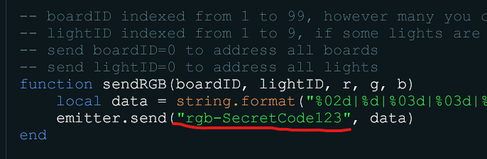
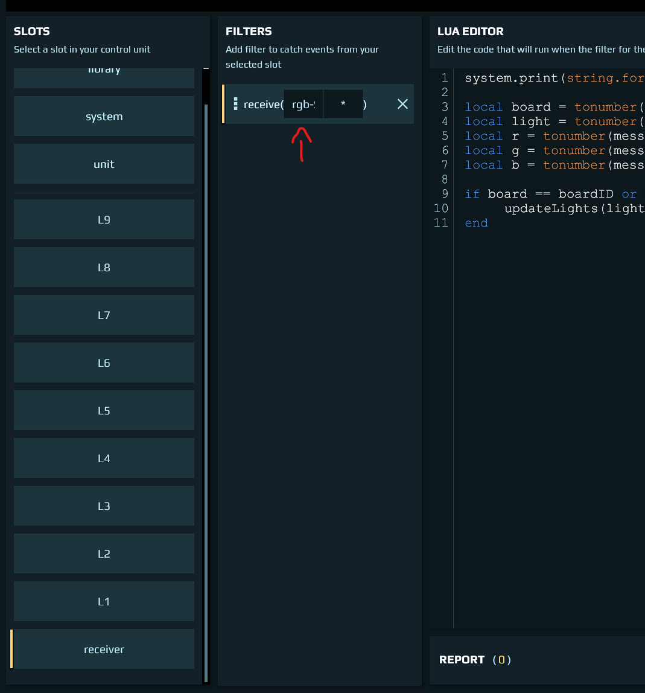

# addressable-lights
A script consisting of main board and auxillary board(s), communicating using emitter and receiver.

As a demonstration, the main board supports taking commands from player, but **this system is not intended to be used directly by players, you should control it by code.**

## Video

[See video here how it works](https://unstable.life/pending-universe/addressable-lights.mp4)

### Setup (Main board)
1. Consider taking out the `sendRGB` function and just using it in your own code, that's all you have to do to integrate this system into your code.
2. Copy `addressable-lights-main.json` contents into the clipboard and paste into the programming board
3. Link emitter to the programming board
4. Link a 3-counter to the programming board

### Setup (3 aux boards)
1. Copy `addressable-lights-aux.json` contents into the clipboard and paste into the 3 programming boards
2. Link receiver to all of them
3. Link lights to all of them (you don't have to link all if you just want to try it out, the boards will ignore missing lights)
4. Edit `boardID` either in lua parameters menu or directly in unit.start - every board should have unique ID to make it uniquely addressable

## How to integrate this into your code

### The sendRGB function
- boardID can be 1-99 to address individual boards, or 0 to address all
- lightID can be 1-9 to address individual lights, or 0 to address all
- r, g, b can be 0-255 and represent the individual color channels, or control codes
- send r,g,b=701 to turn the light on
- send r,g,b=702 to turn the light off

### How many lights can this thing handle?
DU starts being a bit unstable when I'm running more than 25 programming boards at once.

### Setup
1. Use `sendRGB` from the main board to send the data. Your programming board has to have an emitter linked to it.
2. Auxillary boards don't have to modified except for their `boardID` to make them uniquely addressable (available in unit.start on in Lua params menu).
3. **Change the sending and receiving channel to something secret! Otherwise anyone knowing the channel name can send data into it and mess up your lights.**
4. ^^^ Change `SecretCode123` in `sendRGB` function to something else, and then change it in aux boards (in receiver's `receive` filter directly)

Main board:

Aux board:

