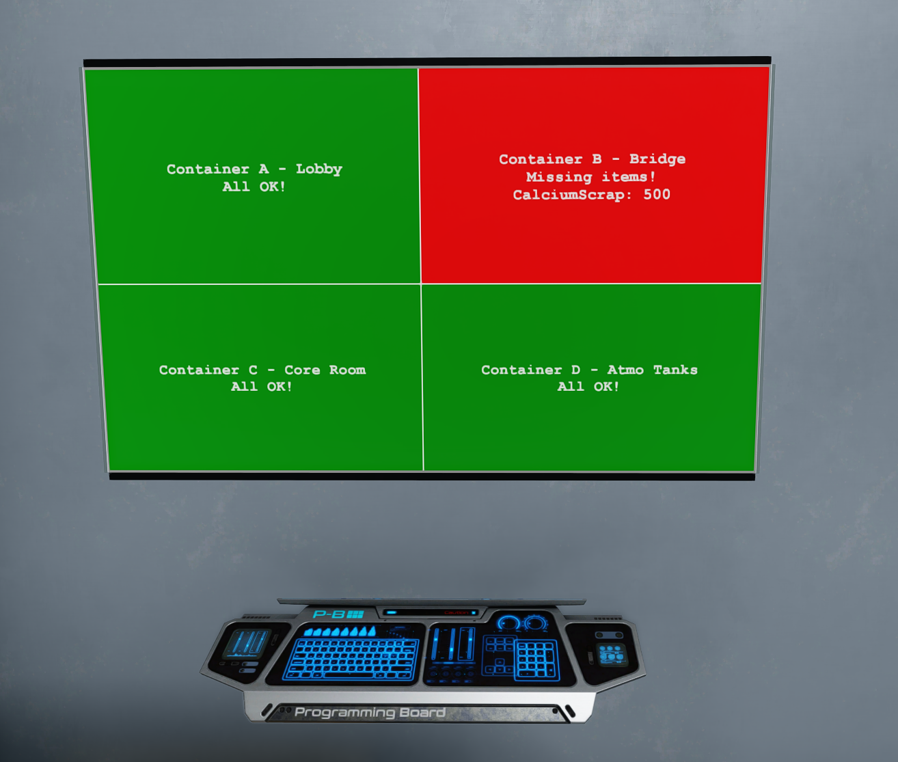

# emergency-container-monitor-demo

A usable example/demo on how to monitor containers for items and warn user if they are missing something.
This is a demo, the code quality is not as good as I would like it to be, but you should be able to understand what's going on if you're looking for an example. Or just use it as-is, it's good enough for me!

### Setup
1. Copy `emergency-container-monitor-demo.json` contents into the clipboard and paste into the programming board
2. Link screen to the programming board
3. Link containers to the programming board
4. Edit container names and the demands list at the top of `unit.start`. 