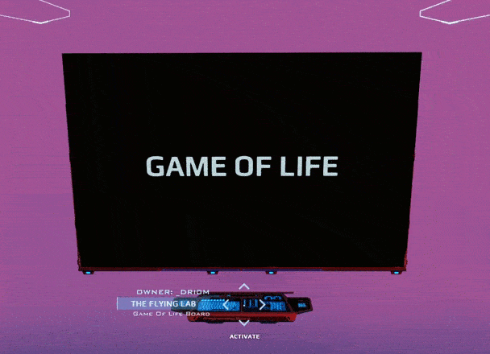

# game-of-life-minimal

Super simple game of life. Rendering is done by drawing a SVG rect for every living cell.

The parameters (board size, colors, speed, initial setup) are not exported, but they are at the top of `unit.start` for you to play with.

